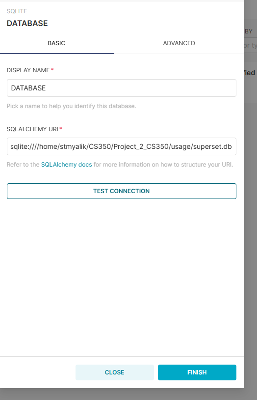
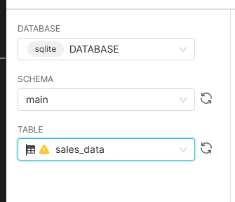
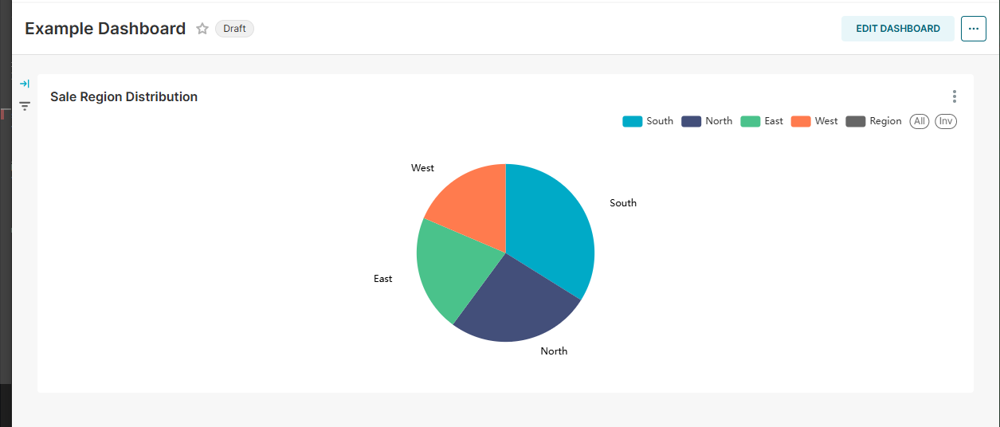

Setup instructions: 

Virtual environment:
``python3 -m venv superset-venv``
``source superset-venv/bin/activate``

Installations and setup:
``pip install apache-superset flask``
``export FLASK_APP=superset``
``touch superset_config.py``
``export SUPERSET_CONFIG_PATH=$(pwd)/superset_config.py``

use: ``openssl rand -base64 42`` to generate secret key
alter superset_config.py with secret key: 
``SECRET_KEY = "xyz"``
``touch superset.db``
``superset db upgrade``
``superset fab create-admin`` and follow instructions
Add permissions: `superset fab create-permissions`


so superset_config should look like, with your path and secret key.
```BASH
SECRET_KEY = "your-secret-key"
PREVENT_UNSAFE_DB_CONNECTIONS = False
SQLALCHEMY_DATABASE_URI = "sqlite:////YOUR PATH/superset.db"
```


``superset run -p 8088 --with-threads --reload --debugger``

now you can log in at https://localhost:8088


Setting up visualization of data:

Add the database: 
- settings => database connections => + database
- select SQLite and provide the SQLAlchemy URI: ``sqlite:////YOUR PATH/superset.db``
- make the connection
- it should now show up in the list of database connections



creating dataset from the CSV File:
Do this in terminal

``sqlite3 /YOUR PATH/Project_2_CS350/usage/superset.db``
 ```BASH
            CREATE TABLE sales_data (
                Date TEXT,
                Region TEXT,
                Product TEXT,
                Sales INTEGER,
                Profit INTEGER
            );  
```
 ``.mode csv``
 ``.import /YOUR PATH/Project_2_CS350/usage/sales_data.csv sales_data``
make sure it exists: ``SELECT * FROM sales_data LIMIT 10;``
``.exit``

Now move back to the Superset UI

Adding the dataset:
- select + => data => create dataset
- select the database
- select the "sales_data" table
- click "create dataset and create chart"



Now creating a chart
- select dataset
- for this select pie chart 
- for dimensions select: "Region"
- for metric select: "sales" and aggregate by "SUM"
- create the chart

You should now have a dataset and a chart. 
You can make more charts in the same manner.


Now you can make a dashboard:
- go to the dashboard tab
- click "+ dashboard"
- Drag and drop the existing chart into the dashboard, or you can make one right there
- name it
- save it

You now have a dashboard.



